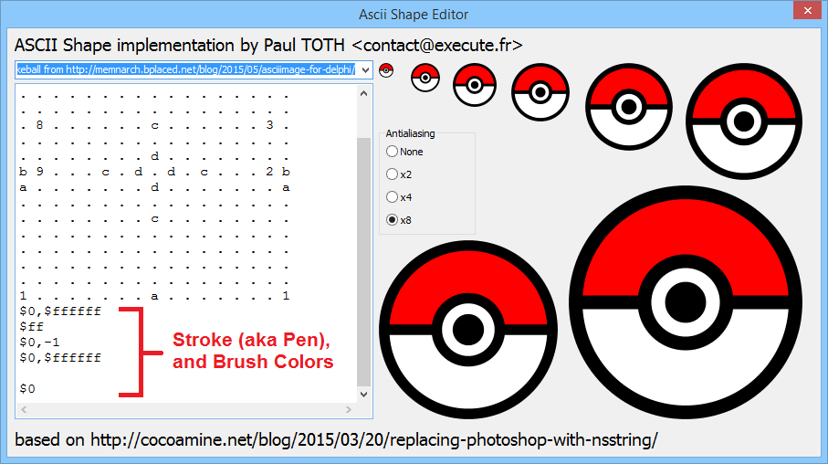

#AsciiShape

an ASCII Shape editor for Delphi Berline

based on:
http://cocoamine.net/blog/2015/03/20/replacing-photoshop-with-nsstring/

another Delphi implemenation (with the Pokeball shape)
https://github.com/Memnarch/AsciiImage
