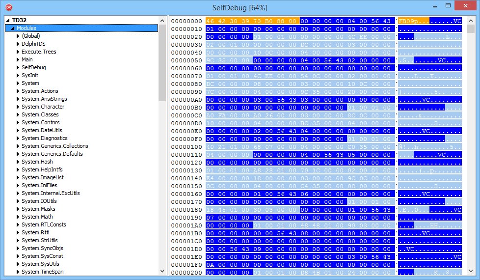

# DelphiTDS

the purpose of this application is to display as much information as possible about debug info (TDS)

the TDS format informations sources are:

https://github.com/project-jedi/jcl/blob/master/jcl/source/windows/JclTD32.pas
https://sourceforge.net/p/tds2dbg/code/HEAD/tree/trunk/tdscvstructs.h
http://denisenkomik.narod.ru/main.cpp