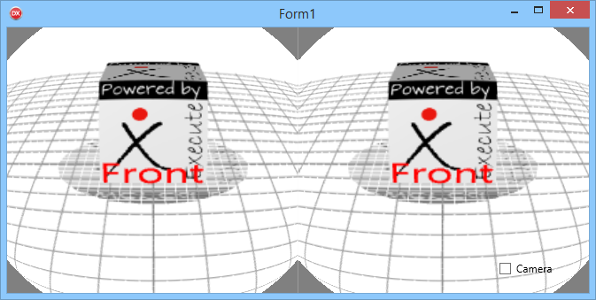

#Cardboard Demo for Delphi

1. StereoView
> Demonstration of the Stereo effect

2. LensEffect
> Demonstration of the Lens Distortion effect

3. NativeSensor
> How to read Android Native ROTATION_VECTOR

4. FullDemo
> Put everything in a single application

(c)2016 Execute SARL
http://www.execute.fr

Quand j'ai découvert les Cardboard sous Android, j'ai trouvé cela très cool, et comme il n'existait pas d'équivalent pour Delphi version Android, j'ai cherché à le faire.

Delphi propose en effet un environnement de développement évolué très accès sur l'assemblage de composants près à l'emploi, mais il permet également de descendre très bas dans la programmation, d'exploiter les API natives des différents OS qu'il supporte (Windows, Mac, iOS, Android) et de, pourquoi pas, créer ses propres composants réutilisables.

C'est l'objet de la vidéo que j'ai réalisé et qui est consultable dans le lien ci-dessous
https://www.barnsten.com/fr/blog/firemonkey.html

Les sources du projet sont également disponibles sur Github
https://github.com/tothpaul/Delphi/tree/master/Google%20Cardboard

Etant développeur Freelance très demandé pour mes compétences sur Delphi, et père de 4 enfants, je n'ai malheureusement pas énormément de temps à consacrer aux projets personnels, ces une des raisons pour lesquelles le projet est disponible sur Github, afin de permettre à la communauté des développeurs Delphi d'explorer la réalité virtuelle avec Delphi.

Il est à noter que, contrairement à Android Studio, Delphi pour Android compile l'application Delphi sous forme de librairie native ARM. Le code Java permettant de la charger est inclus dans le compilateur Delphi, bien qu'il soit remplaçable pour des besoins spécifiques, le développeur Delphi peut se contenter de la version fournie sans avoir à mettre les mains dans Java.

Le framework vectoriel Firemonkey utilisé est compatible Windows, Mac, iOS et Android, aussi le même projet développé pour Android pourra, par une simple option de compilation, être déployé sur une autre plateforme. Ceci dans la limite évidente où l'on ne fait pas un appel direct à des API spécifiques de l'OS; Firemonkey pour sa part propose une implémentation de chaque fonction sur l'ensemble des plateformes supportées.

Dans le cadre de mon projet Cardboard, la partie stéréoscopique de la vidéo s'appuie sur le framework Firemonkey et fonctionne donc  à l'identique sur toutes les plateformes. Pour le Headtracking, j'ai par contre choisi de lire les données directement au niveau de l'API Android en m'inspirant du code Java. Cette portion est donc ciblée Android. Ne disposant pas d'iPhone je n'ai fait aucun effort de support de cet environnement, je suppose cependant que la lecture des capteurs d'orientation doit donner des valeurs très similaires à ceux d'Android. Le portage ne devrait donc pas être bien compliqué, notamment car les calculs mathématiques autour des valeurs du capteur sont écrits en langage Delphi directement compilable pour toutes les plateformes. La seule partie à adapter concerne l'acquisition des données.
