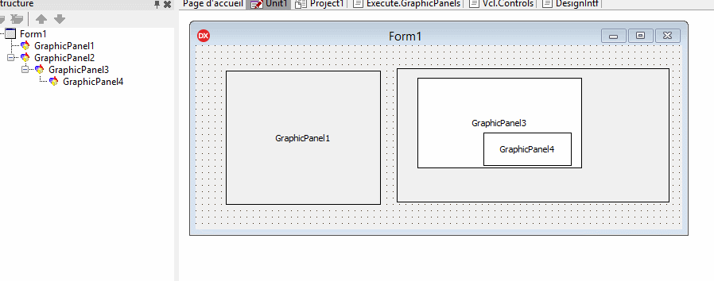

# TGraphicControl

A TGraphicControl that supports a GraphicParent property

Know bugs:
- the selector is not hidden from the Form (see Gif image) 
- the Top/Left properties are not related to the parent Panel...and I don't know how to fix this bug :/

New version with an AlignWeigth property, see [Demo1](https://github.com/tothpaul/Delphi/tree/master/GraphicPanels/Demo1)