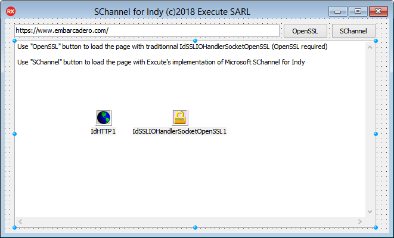

# SChannel TLS support for Indy

With this code you can replace the OpenSSL dependend TIdSSLIOHandlerSocketOpenSSL component with a SChannel ([Secure Channel](https://msdn.microsoft.com/fr-fr/library/windows/desktop/aa380123(v=vs.85).aspx)) based component.

**WARNING**, you can have an error after Windows update 21H2, it's a Microsoft bug fixed with [KB5020435](https://support.microsoft.com/en-us/topic/october-17-2022-kb5020435-os-builds-19042-2132-19043-2132-and-19044-2132-out-of-band-243f34de-2f44-4015-a224-1b68a4132ca5)



```Pascal
procedure TForm1.Button1Click(Sender: TObject);
begin
  Load(IdSSLIOHandlerSocketOpenSSL1);
end;

procedure TForm1.Button2Click(Sender: TObject);
begin
  if SChannel = nil then
    SChannel := TIdSSLIOHandlerSocketSChannel.Create(Self);
  Load(SChannel);
end;

procedure TForm1.Load(IOHandler: TIdIOHandler);
var
  Reply: TMemoryStream;
begin
  IdHTTP1.IOHandler := IOHandler;
  Reply := TMemoryStream.Create;
  try
    IdHTTP1.Get(Edit1.Text, Reply);
    Reply.Position := 0;
    Memo1.Lines.LoadFromStream(Reply);
  finally
    Reply.Free;
  end;
end;
```
