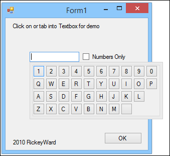

#NoFocusForm

It's an attempt to create a popup form like this .Net demo

https://www.codeproject.com/Articles/71808/Creating-a-Form-That-Doesn-t-Take-Focus

but it doesn't work very well :/

:[delphi](DelphiVersion.png)