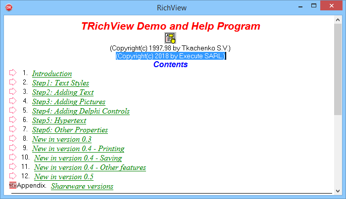

# RichView by Execute

this project is inspired by the excellent [TRichView](http://www.trichview.com) component.

there's an old freeware+source version on [Torry](https://torry.net/quicksearchd.php?String=TRichView+%28freeware%29+v.0.5.2).

TRichView is highly tied to the VCL and Windows, my purpose with this component is to split things as much as possible

- `TRichDocument` contains the document
- `TVCLRichDocument` extends `TRichDocument` to support `TImage` and `TImageList` (like `TRichView` did)
- `TRichRenderer` is used to display the component
- `TWinRichRenderer` is a Windows implementation of `TRichRenderer`
- `TVCLRichRenderer` is the renderer used in the VCL context
 
 `TRichEditor` binds them all for an easy-to-use VCL Component (no it's not an Editor for now)
 
 
 
 I've made a (french) video about [CrossVCL](http://www.crossvcl.com) compatibility
 
 
 
 We can talk (in french) about that on [developpez.com](https://www.developpez.net/forums/d1812813/environnements-developpement/delphi/video-presentation-crossvcl/)