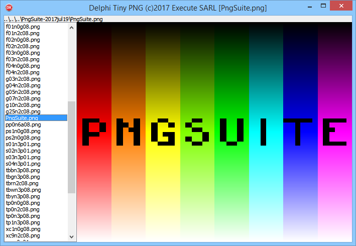

TinyPNG for Delphi Tokyo

small unit to load PNG files under Delphi Tokyo

The purpose of this unit it to give a fast, small an efficient unit to Load PNG files under Delphi

This unit do no support all PNG format

 - 2, 4 and 16 bits format are not supported
 - interlaced image are not supported
 - 1 bit palette is ignored (image is always black and white)

But, it work perfectly for

 - 1, 8 bits format
 - GRAYSCALE, GRAYSCALE_ALPHA, PALETTE, RGB, and RGBA format

The code is also easy to follow with sufficient comments

a PNG file looks like this

	+----+
	|Sign| 8 bytes signature
	+----+
	|IHDR| 13 bytes required header
	+----+
	: ?? : (optional chunks)
	+----+
	|PLTE| optional palette
	+----+
	: ?? : (optional chunks)
	+----+
	|IDAT| Image Data (GZIPed) - can be splitted over multiples IDAT chunks !
	+----+
	:  + : (optional additionnals IDAT chunks)
	+----+
	: ?? : (optional chunks)
	+----+
	|IEND| Image End
	+----+

After "Sign", each Chunk (including IHDR) uses the same format
	+------+
	| Size |  Number of bytes in the Data part (let the loader ignore unknown chunk)
	+------+
	| Name |  4 bytes to identify the Chunk (IHDR, PLTE, IDAT, IEND...)
	+------+
	| Data |  Data of the chunk
	+------+
	| CRC  |  CRC of the chunk (ignored by PNGLoader)
	+------+

http://www.libpng.org/pub/png/spec/1.2/PNG-Chunks.html

IDAT contains the Bitmap with an extra byte on top of each line for filtering
	+------+--------------------------+
	|Filter| Pixels of the first Line |
	+------+--------------------------+
	:Filter: Pixels of the next  Line : as many time as required
	+......+..........................+

Pixels can be a Palette Index, a Graycsale value, RGB, ARGB value,
or a pair of GrayScale/Alpha values.

the goals of the loader is to identify the image format, extract the IDAT part,
decompress (deflate) the data, apply the filters and copy the data to the bitmap