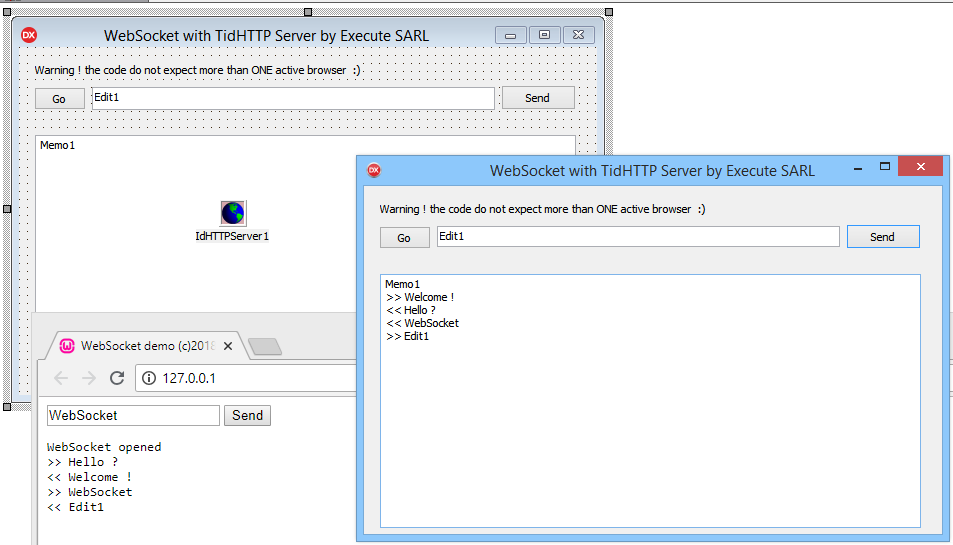

# WebSocket demo for Delphi Tokyo and Indy components

TWebSocket is a tiny class that transform a standard GET request of TidHTTPServer into a WebSocket dialog.

Note that this little demo do not handle multiple connexions, you have to deal with multiples instances of TWebSocket.

If you want to exchange JSON data, you can use my [JSON Unit](https://github.com/tothpaul/LetsEncryptDelphi/blob/master/lib/Execute.JSON.pas) for  instance.

You can also request integration support to [Execute](http://www.execute.fr).